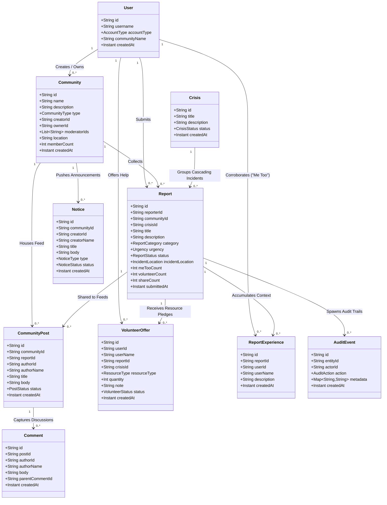

# Data Models & Relationships Architecture

This document breaks down the structural models, fields, architectures, and entity relationships across the **Umphakathi** platform. It maps how core user interactions, community boundaries, crisis escalations, validation tools, and logging streams connect.

## 📊 UML Class Diagram

---

## 🗂️ Core Models Detail

### 1. `User`
Represents the primary account entity node. Can represent an individual citizen (`PERSON`) or an official operational group (`ORGANIZATION`).
*   **Key Fields**: `id`, `username`, `accountType`, `communityName`.

### 2. `Community`
A spatial, geographical, or institutional group binding local members together.
*   **Key Fields**: `id`, `name`, `type` (`GEOGRAPHIC`, `ORGANIZATION`), `ownerId`, `moderatorIds`, `memberCount`.

### 3. `Report`
The fundamental entity modeling a reported community issue or critical incident (e.g., infrastructural failure, utility outage, safety threat).
*   **Key Fields**: `id`, `reporterId`, `communityId`, `crisisId` *(Nullable)*, `category`, `urgency`, `status`, `incidentLocation` (Embedded coordinate and spatial details).

### 4. `Crisis`
An aggregated macro-event grouping multiple isolated reports together when incidents cascade into regional critical threats.
*   **Key Fields**: `id`, `title`, `description`, `status`.

### 5. `CommunityPost`
An interactive social timeline entry inside a community used to disseminate information or echo a parent `Report` item.
*   **Key Fields**: `id`, `communityId`, `reportId` *(Nullable)*, `authorId`, `title`, `body`, `status`.

### 6. `Comment`
Nested threads linking back to community posts, reports, or update boards for crowdsourced chat streams.
*   **Key Fields**: `id`, `postId` (Polymorphic tracking ID), `authorId`, `body`, `parentCommentId` *(Nullable)*.

---

## 🔗 Data Relationships & Cardinalities

### 👥 User Actions
*   **User ── (1 : 0..*) ── Community**: A user can discover, join, administer, or moderate multiple distinct community networks.
*   **User ── (1 : 0..*) ── Report**: Citizens register multiple unique status declarations/issues over time.
*   **User ── (1 : 0..*) ── VolunteerOffer**: A user logs individual resource guarantees (manpower, tools, logistics) to back dynamic field demands.

### 🏘️ Community Boundaries
*   **Community ── (1 : 0..*) ── Report**: Hazards are cataloged under the immediate protective boundary of a specific local community.
*   **Community ── (1 : 0..*) ── CommunityPost**: Social interactions, alerts, and shared posts live inside the respective community timeline feed.
*   **Community ── (1 : 0..*) ── Notice**: Official bulletins, emergency declarations, or service interruptions (`Notice`) target members within that network.

### 🚨 Crowdsourced Verification & Mutual Aid
*   **Report ── (1 : 0..*) ── ReportExperience ("Me Too")**: Many peripheral users attach subjective accounts to a single main report to amplify impact tracking and clear priority bottlenecks without creating duplicates.
*   **Report ── (1 : 0..*) ── VolunteerOffer**: A standalone utility listing can receive several targeted aid allocations mapping explicit inventory metrics.
*   **Crisis ── (1 : 0..*) ── Report**: A crisis entity indexes dozens of distinct report instances to give response teams a unified spatial look at systemic emergencies.

### 📋 History & Governance Tracks
*   **Report ── (1 : 0..*) ── AuditEvent**: Every automated triage transition, authority signature, or severity escalation registers a distinct, immutable history event row (`AuditEvent`) pointing explicitly to the asset container via `entityId`..
